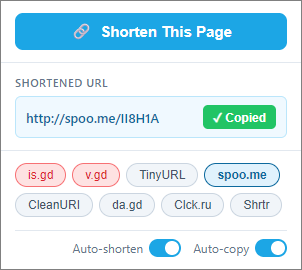

# Ziplink

Chrome extension (Manifest V3) that shortens the current tab's URL in one click. Supports multiple shortening services. Result auto-copies to clipboard.

No build step. No bundler. No dependencies. Chrome loads the files directly as ES modules.

<div align="center">



</div>

## Install (development)

1. Open `chrome://extensions`
2. Enable **Developer mode**
3. **Load unpacked** → select this folder
4. Click the Ziplink icon in the toolbar

After any code change, click the refresh icon on the extension card.

## Usage

1. Navigate to any page
2. Click the Ziplink toolbar icon
3. Select a shortening service (pill buttons)
4. Click **Shorten**
5. Short URL appears and is auto-copied to clipboard

Toggle **Auto-copy** off to copy manually. Selected service and auto-copy preference persist via `chrome.storage.sync`.

## Services

| Service | Domain |
|---------|--------|
| is.gd | `https://is.gd/` |
| v.gd | `https://v.gd/` |
| TinyURL | `https://tinyurl.com/` |
| CleanURI | `https://cleanuri.com/` |
| da.gd | `https://da.gd/` |
| Clck.ru | `https://clck.ru/` |
| Shrtr | `https://shrtr.top/` |
| Ulvis | `https://ulvis.net/` |

## Adding a service

1. Create `services/newservice.js` implementing the contract:
   ```js
   export default {
     id: 'newservice',
     name: 'New Service',
     async shorten(url) {
       // call API, return short URL string or throw Error
     }
   };
   ```
2. Import and add to the `services` array in `services/registry.js`
3. Add the service domain to `host_permissions` in `manifest.json`

The popup generates service pills dynamically — no other changes needed.
